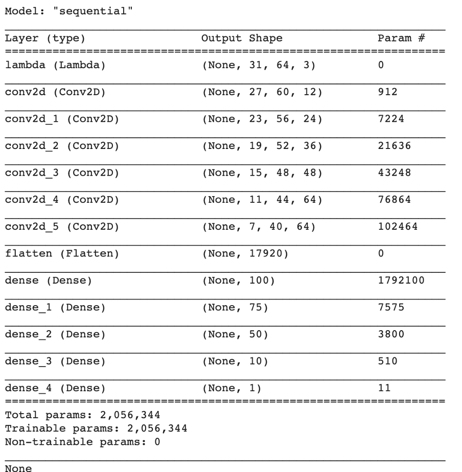
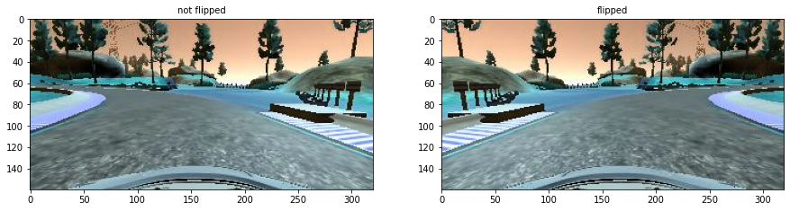
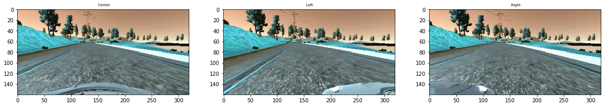
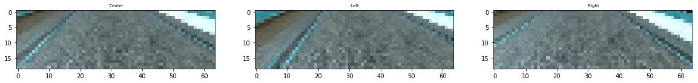

# **Behavioral Cloning** 


---

**Goals**

The goals / steps of this project are the following:
* Use the simulator to collect data of good driving behavior
* Build, a convolution neural network in Keras that predicts steering angles from images
* Train and validate the model with a training and validation set
* Test that the model successfully drives around track one without leaving the road
* Summarize the results with a written report


[//]: # (Image References)

[image1]: ./examples/placeholder.png "Model Visualization"
[image2]: ./examples/placeholder.png "Grayscaling"
[image3]: ./examples/placeholder_small.png "Recovery Image"
[image4]: ./examples/placeholder_small.png "Recovery Image"
[image5]: ./examples/placeholder_small.png "Recovery Image"
[image6]: ./examples/placeholder_small.png "Normal Image"
[image7]: ./examples/placeholder_small.png "Flipped Image"

## Rubric Points
### Here I will consider the [rubric points](https://review.udacity.com/#!/rubrics/432/view) individually and describe how I addressed each point in my implementation.  

---
### Files Submitted & Code Quality

#### 1. Submission includes all required files and can be used to run the simulator in autonomous mode

My project includes the following files:
* model_generator.py containing the script to create and train the model
* drive.py for driving the car in autonomous mode
* model_2021_05_17.h5 containing a trained convolution neural network 
* writeup_report.md  summarizing the results
* run1.mp4 files containing the result of the training proccess.
* preprocess.py - support library which containes methods used in model_generator.py

Several support libraries during data collection process
* combine_all_files.py - combine all images from  various training runs 
* test_samples.py - checks that all images collected correctly 

#### 2. Submission includes functional code
Using the Udacity provided simulator and my drive.py file, the car can be driven autonomously around the track by executing 
```sh
python drive.py model.h5
```

#### 3. Submission code is usable and readable

The model_generator.py file contains the code for training and saving the convolution neural network. The file shows the pipeline I used for training and validating the model, and it contains comments to explain how the code works.

### Model Architecture and Training Strategy

#### 1. An appropriate model architecture has been employed

My model consists of a convolution neural network with the set of  5X5 filters.
Prior to convolutions normalization lambda layer has been added. 
Convolution layers are followed by flatten layer and the set of dense layers.

To save the memory images are resized to 64x64 size and cropped (only the bottom most meaningfull part has been taken)
This preprocessing step should be done for testing phase as well.


#### 2. Attempts to reduce overfitting in the model

To ensure that the model doesn't overfit the data has been split into train,validation and test sets (lines 74-79 of model_generator.py file

I have tried to use dropout layers, but this did not help to improve the results much (the car was missing the path)
I have played with the number of epochs. Early stop, extended data collection process and deeper model arcitecture has improved the final results (5 epochs is the best option).


#### 3. Model parameter tuning

The model used an adam optimizer, so the learning rate was not tuned manually (model.py line 118).

#### 4. Appropriate training data

Training data has been chosen to keep the vehicle driving on the road. 
I have tried to record the behaviour many times.

Mouse usage allowed to drive smothly on turns and not to do cutting movements in general.
Also tried to record clockwise and have taken 1ap data from the track 2 as simply runing on track1 could be biased to left turns.
Additional augmentation has been used as well(see below)


### Model Architecture and Training Strategy

#### 1. Solution Design Approach


I have used number of attemps and played with the model architecture as well as construction of the images for the training process.

First attempts where done on 2 laps of the track one. Surprisingly the mse on validation set was slightly lower on validation set rather then on traning set.

Model was not generalizing well on the test run and car was losing the track.

Finally I have created the deeper model ( added additional  Conv2D(12,(5,5) layer with ReLu activation) and Dense(75) layer)) 

Combination of the the deeper architecture and extended traning dataset allowed to improve the final result.

The final step was to run the simulator to see how well the car was driving around track one.

My first attemps did not help to drive smoothly on the track one. 
Car could get stuck on some parts of the track or get off the road.

The last 2 chages(deeper network+ data collection) + play with the number of epochs  allowed to improve the result - the car started to drive smothly without losing the road on track one.


#### 2. Final Model Architecture

The final model architecture (model.py lines 98-115) consisted of a convolution neural network with the following layers and layer sizes 




#### 3. Creation of the Training Set & Training Process


I have recorder the number of images for the training purpose to generalize better:

1. Have included 2 laps for the track one 
2. Added one lap in the clockwise direction
3. Added separate laps concentating on recovering from sides to center driving
4. Have tried to add one lap from track two


On the top of that i have done some augmentation.

1. Have flipped the images (to reduce  left turn bias) - finally have switched this off as collection prosecces has already included clockwise lap  + data from track 2
2. Have used the data from all 3 cameras (center,left,right)

Here is the example of flipped image 





Here is the example of the view from each camera + cropped results from each camera:





After the collection process and before passing the data to the neural network the data has been resized (to save the memory) and 
cropped (to concentrate on the most important parts of the image and remove noisy data) 

I finally randomly shuffled the data set and put 15% of the data into a validation set and 15% to the separate test set. 

I used this training data for training the model. The validation set helped determine if the model was over or under fitting. The ideal number of epochs was 5. Increasing the number of epochs to 10 did not help to improve the result. Sometimes result even got worse.
I used an adam optimizer so that manually training the learning rate wasn't necessary.


The final video on the test run is  available by the link on run1.mp4 file.

https://github.com/nygilmanov/slfdr_project4_behaviour_cloning/blob/main/run1.mp4


